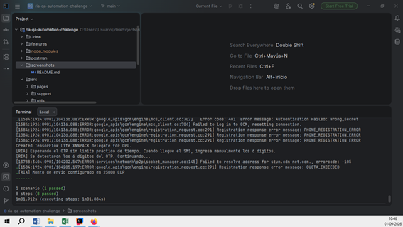

# ria-qa-automation-challenge

Proyecto reescrito desde cero para eliminar selectores heredados.

## Selector de cookies

En `https://secure.riamoneytransfer.com/login` se usa exclusivamente:

```css
button[analytics-name="consent-manager-allow-all-cookies"]
```

Antes de hacer clic, el código valida que:
- el elemento sea `button`;
- el atributo `analytics-name` sea exactamente `consent-manager-allow-all-cookies`.

## Flujo de login

1. Abrir Ria.
2. Presionar `Start your transfer`.
3. Esperar `/login`.
4. Presionar exactamente `Permitir todas las cookies`.
5. Confirmar desaparición del modal.
6. Ingresar correo.
7. Ingresar contraseña.
8. Presionar `Iniciar sesión`.
9. Validar área autenticada.

## Ejecución

```powershell
npm install
npm test
```

Solo login:

```powershell
npm run test:login
```

## Ejecución lenta

`src/utils/config.js`:

```javascript
stepDelayMs: 2000
```

## Seguridad

`.env` está excluido por `.gitignore`.


## Cobertura QA Engineer Test 6

La V23 agrega cobertura explícita para:
- mensaje `Introduzca un importe válido` con caracteres alfabéticos;
- selección de Haití;
- importe `25000`;
- moneda origen `CLP`;
- moneda destino `HTG`;
- validación de monto convertido mayor que cero;
- redirección a la página segura;
- presencia de `Registrarse`;
- presencia de teléfono/correo;
- presencia de contraseña;
- clic en `Registrarse`;
- validación del flujo/página de selección de país;
- colección Postman GET/POST incluida.

El login con credenciales queda como escenario adicional y no reemplaza los criterios obligatorios del reto.

## Evidencias pendientes para la entrega

Antes de subir a GitHub:
1. Ejecutar Selenium y guardar captura exitosa en `/screenshots`.
2. Ejecutar Postman Collection Runner y guardar captura con assertions PASS en `/screenshots`.
3. Crear repositorio privado.
4. Agregar los colaboradores solicitados en el documento del reto.


## V24 - Clave dinámica / OTP

Se agregó un flujo adicional para autenticación con clave dinámica:

1. Selenium ingresa correo y contraseña.
2. Presiona el botón para solicitar/enviar la clave dinámica.
3. Espera hasta **120 segundos**.
4. El usuario escribe manualmente el OTP recibido en su teléfono.
5. Selenium detecta que el campo OTP tiene contenido.
6. Presiona automáticamente el botón de validar/verificar/continuar.
7. Espera el acceso al área autenticada.

### Ejecutar solo OTP

```powershell
npm run test:otp
```

### Nota sobre selectores OTP

El documento original del reto no define los textos ni atributos de la pantalla OTP.
Por eso los selectores están centralizados en `src/pages/RiaLoginPage.js` como
`sendOtpButtonCandidates`, `otpInputCandidates` y `validateOtpButtonCandidates`.
Si la interfaz real usa otra etiqueta, basta con ajustar esos selectores sin cambiar los steps.


## V25 - Segunda validación después del OTP

Después de validar la clave dinámica, la automatización espera el modal:

`¿Quieres que recordemos este dispositivo?`

y selecciona automáticamente **No** utilizando el atributo estable observado en la interfaz:

```css
button[analytics-name="remember-my-device-modal-no"]
```

Después verifica que el modal desaparezca y continúa con la validación del área autenticada.


## V26 - Corrección de sincronización del modal "recordar dispositivo"

La V25 fallaba porque el step verificaba el modal inmediatamente después de validar el OTP.

La V26 ahora:
1. Espera hasta 30 segundos a que aparezca el botón `No`.
2. Confirma que el botón sea visible.
3. Presiona `No`.
4. Espera hasta 30 segundos a que el modal desaparezca.
5. Continúa con la validación del área autenticada.

Selector utilizado:

```css
button[analytics-name="remember-my-device-modal-no"]
```


## V27 - Continuación del flujo autenticado

Después de validar OTP y seleccionar **No** en `¿Quieres que recordemos este dispositivo?`,
la automatización ahora continúa con:

1. Validar acceso a `/activity`.
2. Localizar el botón `Iniciar una transferencia`.
3. Esperar que esté visible y habilitado.
4. Hacer clic.
5. Esperar la navegación a `/send-money` o detectar la pantalla `Enviar dinero`.

### Ejecutar el flujo completo hasta Enviar dinero

```powershell
npm run test:transfer
```


## V28 - Corrección del flujo OTP

Se eliminó por completo la acción que intentaba solicitar/enviar manualmente la clave dinámica.

La pantalla real confirma que Ria envía automáticamente el código al entrar en:

`https://secure.riamoneytransfer.com/otp/login`

### Nuevo flujo

1. Selenium ingresa correo y contraseña.
2. Presiona `Iniciar sesión`.
3. Espera la URL `/otp/login`.
4. Ria envía automáticamente el SMS.
5. Selenium no presiona ningún botón para solicitar el código.
6. El usuario ingresa manualmente los 6 dígitos recibidos.
7. Selenium detecta los 6 dígitos.
8. Presiona automáticamente `Listo`.
9. Espera `¿Quieres que recordemos este dispositivo?`.
10. Presiona `No`.
11. Valida `/activity`.
12. Presiona `Iniciar una transferencia`.
13. Espera `/send-money`.

El único paso manual es escribir el OTP recibido por SMS.


## V29 - Timeout ampliado para OTP

Se corrigió el conflicto entre el timeout de Cucumber y el tiempo de espera del OTP.

### Nuevos tiempos
- `otpTimeout`: 180000 ms = 3 minutos
- `setDefaultTimeout`: 240000 ms = 4 minutos

Esto permite que el step del OTP siga vivo mientras se espera la llegada del SMS y el ingreso manual del código.

### Importante sobre el SMS
La automatización no controla la entrega del mensaje de texto. Si Ria muestra `/otp/login`
pero el SMS no llega al teléfono, el flujo esperará hasta 3 minutos y luego fallará con un mensaje
claro indicando que el OTP no fue recibido/ingresado a tiempo.

No se reintroduce ninguna acción para solicitar el OTP manualmente; Ria sigue siendo quien lo envía
automáticamente al entrar al flujo de verificación.


## V30 - Espera extendida del OTP

Se amplió la espera del código SMS para evitar que la automatización falle por demoras externas.

### Nuevos tiempos
- OTP: **600000 ms = 10 minutos**
- Timeout global de Cucumber: **720000 ms = 12 minutos**

### Flujo
1. Selenium inicia sesión.
2. Ria envía el OTP automáticamente.
3. Selenium espera hasta 10 minutos.
4. El usuario ingresa manualmente los 6 dígitos.
5. Selenium presiona `Listo`.
6. Selenium selecciona `No` en recordar dispositivo.
7. Continúa a `/activity`.
8. Presiona `Iniciar una transferencia`.
9. Espera `/send-money`.

Nota: la automatización no controla ni fuerza la entrega del SMS.


## V31 - Validación en pantalla Enviar dinero

Después del login completo y de llegar a `/send-money`, la automatización:

1. Abre `Estás enviando a`.
2. Selecciona **Haití**.
3. Localiza el campo **Envías**.
4. Limpia el monto actual.
5. Ingresa `abc`.
6. Sale del campo para disparar la validación.
7. Verifica el mensaje `Ingresa un monto mayor`.

### Ejecutar este flujo

```powershell
npm run test:send-money
```

El OTP continúa siendo manual.


## V32 - Ajuste de monto

Se mantiene el flujo validado de la V31 y se modifica únicamente el monto del escenario de transferencia:

- País destino: **Haití**
- Moneda de envío: **CLP**
- Monto a enviar: **2500 CLP**

La prueba ahora ingresa `2500` en el campo **Envías** y verifica que el campo conserve ese monto.


## V33 - Postman corregido según QA Engineer Test 6

Se mantiene el flujo Selenium de la V32 y se corrige la colección Postman.

### GET
Endpoint:
`https://jsonplaceholder.typicode.com/posts/`

Validaciones:
- Status 200 OK.
- Todos los campos `title` y `body` tienen contenido.
- Ningún `title` ni `body` contiene la palabra `zombie`.

### POST
Endpoint:
`https://httpbin.org/post`

Body utilizado:

```json
{
  "student": "Tim Allen",
  "email_address": "tim@homeimprovement.com",
  "phone": "(408) 8674530",
  "current_grade": "B+",
  "topping": [
    "bacon",
    "cheese",
    "mushroom"
  ]
}
```

Validaciones:
- Status 200 o 201.
- `topping` contiene `bacon`, `cheese`, `mushroom`.
- `topping` no contiene `chicken`.


## V34 - Corrección del flujo Enviar dinero

Se corrigió el selector del país para que no dependa del valor preseleccionado.

Flujo:
1. Llegar a `/send-money`.
2. Abrir `Estás enviando a`.
3. Seleccionar **Haití**.
4. Validar moneda destino **HTG**.
5. Reemplazar el monto actual por **25000 CLP**.
6. Validar que el campo quede en `25000`.
7. Validar que el monto convertido sea mayor que cero.

Esto queda alineado con el criterio oficial: **25000 CLP a Haití (HTG)**.


## V35 - Monto de envío fijado en 25.000 CLP

La automatización mantiene el flujo de la V34 y refuerza explícitamente:

- País destino: **Haití**
- Moneda de envío: **CLP**
- Monto: **25.000 CLP**
- Moneda destino: **HTG**

El script ingresa `25000` en el campo de monto y valida el valor numérico,
aceptando que la interfaz lo muestre visualmente como `25,000` o `25.000`.
También valida que la moneda de envío sea `CLP`.


## V36 - Espera del OTP sin límite práctico

Se eliminó el límite fijo de 10 minutos para recibir la clave dinámica.

Nuevo comportamiento:
1. Selenium llega a `/otp/login`.
2. Ria envía el SMS automáticamente.
3. La automatización permanece esperando sin un corte de tiempo operativo.
4. Cuando el usuario ingresa manualmente los 6 dígitos, Selenium detecta el OTP.
5. Continúa con `Listo`, `No` recordar dispositivo, `/activity`, `Iniciar una transferencia`, Haití y 25.000 CLP.

Implementación:
- `waitForManualOtpEntry()` usa un bucle de espera con polling cada 1 segundo.
- `otpTimeout` ya no tiene un valor fijo.
- El timeout global de Cucumber se establece al máximo seguro de timer de JavaScript (`2147483647` ms), equivalente a ~24,8 días, para que no interrumpa una espera normal de OTP.


## V37 - Monto de envío

El monto de envío queda fijado explícitamente en **$25.000 CLP (pesos chilenos)**.

En código se utiliza el valor numérico `25000`, porque el punto en `$25.000`
es un separador de miles de presentación. La interfaz puede mostrarlo como
`25.000` o `25,000` según su formato regional.

La espera indefinida del OTP y el resto del flujo de la V36 se mantienen.


## V40 - Corrección definitiva del monto de envío

Esta versión parte de la V37 y corrige específicamente el problema por el cual
Ria mantenía el valor anterior del campo `Envías`.

Selector principal confirmado en DevTools:

```css
input[analytics-name="send-money-amount-from-amount"]
```

Flujo de asignación:
1. Selenium localiza exactamente el input de `Envías`.
2. Intenta limpiar e ingresar `25000` mediante teclado.
3. Si Ria restaura el valor anterior, usa el setter nativo del input.
4. Dispara eventos `input`, `change` y `blur`.
5. Verifica que el valor numérico final del DOM sea exactamente `25000`.

Monto requerido: **$25000 CLP**.


## V41 - Corrección del orden del flujo

Problema detectado:
la versión anterior esperaba `HTG` inmediatamente después de seleccionar Haití,
por lo que nunca llegaba a ejecutar la asignación de `$25000 CLP`.

Nuevo orden:
1. Seleccionar Haití.
2. Ingresar `25000` en `Envías`.
3. Validar `25000 CLP`.
4. Seleccionar `HTG` en `Los destinatarios reciben`.
5. Validar `HTG`.
6. Validar que el monto convertido se actualice.

Selector principal del monto:
```css
input[analytics-name="send-money-amount-from-amount"]
```
## Evidencia de ejecución

### Selenium + Cucumber — Flujo E2E

Ejecución exitosa del escenario automatizado de envío de dinero en Ria Money Transfer.

**Resultado:**
- 1 escenario ejecutado.
- 1 escenario aprobado.
- 8 pasos ejecutados.
- 8 pasos aprobados.



## Ejecución del proyecto

Para ejecutar la automatización, abrir una terminal desde la raíz del proyecto y seguir los siguientes pasos:

### 1. Instalar las dependencias

```bash
npm install
```

Esperar hasta que finalice completamente la instalación de las dependencias.

### 2. Ejecutar el escenario automatizado

```bash
list
```

Este comando ejecuta el escenario automatizado E2E de envío de dinero utilizando Selenium WebDriver y Cucumber.


## Resumen de transferencia en consola

Al ejecutar el escenario `@sendmoney` con:

```bash
npm run test:send-money
```

la automatización muestra al final del flujo los valores reales obtenidos desde la pantalla de Ria:

```text
[RIA] Monto enviado: 25000 CLP
[RIA] Tipo de cambio: 1 CLP = <valor mostrado> HTG
[RIA] Monto recibido: <valor mostrado> HTG
```

El tipo de cambio se intenta leer directamente desde la interfaz. Si la página no lo expone como texto, se calcula la tasa efectiva usando únicamente el monto CLP y el monto HTG mostrados por Ria.
